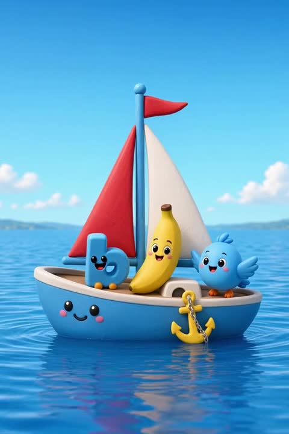
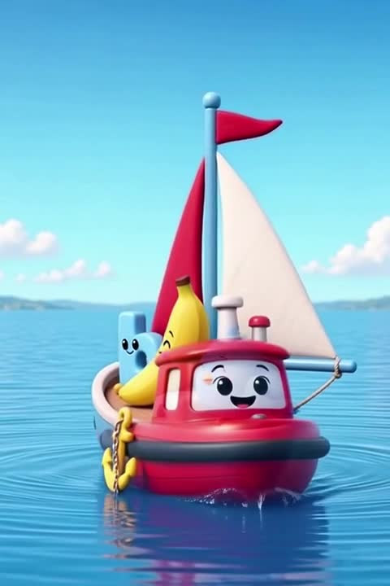

# QA — little b Friends take 1 (ABC-Adventure-Bot1)

**Clip:** `public/friends-clips/b-little-play-1.mp4`  
**Stills:** this folder · `01-start` … `05-end` · boat crop pair below  
**Issue:** https://github.com/sh4gu4dummy-arch/abc-adventure/issues/5  
**Date:** 2026-09-18 · **v0.340**

## Tech

| Probe | Result |
|---|---|
| Duration | **~24.2s** |
| Size | 480×720 |
| Loudness | mean **−20.7** / max **−3.2** → **PASS** |

## Verdict

**FAIL (attribution + boat product drift)**

| Gate | Result | Evidence |
|---|---|---|
| Loudness | **PASS** | −20.7 / −3.2 |
| **Listen attribution** | **FAIL** | Same kid voice / no real lip-sync on speakers |
| **Boat product lock** | **FAIL** | Blue **sailboat** at start → **red tug** ~0:14+ |

## Boat product drift (proof)

Product lock: `public/posters/b-boat.webp` = **sailboat**.

| t | Frame | What |
|---|---|---|
| ≈0.5s |  `boat-start.jpg` | **Blue sailboat** (product family) |
| ≈0:14+ |  `boat-t14-tug.jpg` | **Red tug** hull + black bumper (drift) |

Also visible in audit `04-75.jpg` / `05-end.jpg`.

## Builder remake

1. Speaking mouth matches line; distinct voices (same-voice-all = FAIL).
2. **Boat stays the sailboat** for the whole clip (`b-boat.webp` lock) — no tug morph.
3. Cast count 1 each; hero little-b present through end.

Do **not** I2V on this FAIL until a new film is authorized.
